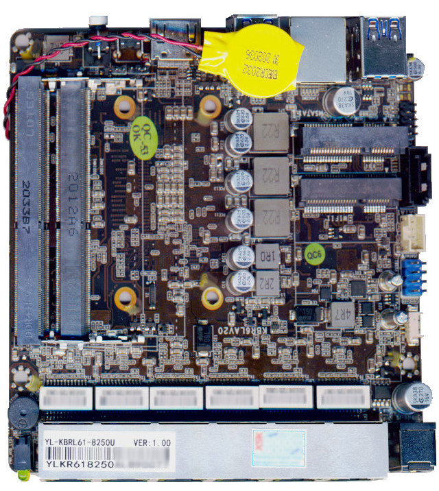

# Yanling YL-KBR6L

This board and therefore its documentation is very, very similar to the Protectli FW6. This document is based on theirs.

This page describes how to run coreboot on the [Yanling YL-KBR6L], or [Yanling N18] as it seems to be called officially (and its three CPU variants).



## Required proprietary blobs

To build a minimal working coreboot image some blobs are required (assuming
only the BIOS region is being modified).

```eval_rst
+-----------------+---------------------------------+---------------------+
| Binary file     | Apply                           | Required / Optional |
+=================+=================================+=====================+
| FSP-M, FSP-S    | Intel Firmware Support Package  | Required            |
+-----------------+---------------------------------+---------------------+
| microcode       | CPU microcode                   | Required            |
+-----------------+---------------------------------+---------------------+
| vgabios         | VGA Option ROM                  | Optional            |
+-----------------+---------------------------------+---------------------+
```

FSP-M and FSP-S are obtained after splitting the Kaby Lake FSP binary (done
automatically by the coreboot build system and included into the image) from
the `3rdparty/fsp` submodule.

Microcode updates are automatically included into the coreboot image by build
system from the `3rdparty/intel-microcode` submodule.

VGA Option ROM is not required to boot, but if one needs graphics in pre-OS
stage, it should be included (if not using libgfxinit).

## Flashing coreboot

### Internal programming

The main SPI flash can be accessed using [flashrom]. The first version
supporting the chipset is flashrom v1.1. Firmware an be easily flashed
with internal programmer (either BIOS region or full image).

### External programming

The system has an internal flash chip which is a 8 MiB soldered SOIC-8 chip.
This chip is located on the bottom side of the case (the radiator side). One
has to remove all screws (in order): 4 top cover screws, 4 side cover screws
(one side is enough), 4 mainboard screws, 4 CPU screws (under DIMMs). Lift up
the mainboard and turn around it. The flash chip is near the SoC on the DIMM
slots side. Use a clip (or solder the wires) to program the chip. Specifically,
it's a Macronix MX25L6436F M2I-08Q (3V) - [datasheet][MX25L6436F].

## Known issues

- assume the same as for Protectli FW6:

- After flashing with external programmer it is always required to reset RTC
  with jumper or disconnect coin cell temporarily. Only then the platform will
  boot after flashing.
- FW6A does not always work reliably with all DIMMs. Linux happens to hang or
  gives many panics. This issue was present also with vendor BIOS.
- Sometimes FSPMemoryInit return errors or hangs (especially with 2 DIMMs
  connected). A workaround is to power cycle the board (even a few times) or
  temporarily disconnect DIMM when platform is powered off.
- When using libgfxinit and SeaBIOS bootsplash, the red color is dim

## Untested

- assume the same as for Protectli FW6:

Not all mainboard's peripherals and functions were tested because of lack of
the cables or not being populated on the board case.

- Internal USB 2.0 headers
- Boot with cleaned ME

## Working

- USB 3.0 front ports (SeaBIOS and Linux)
- 6 Ethernet ports
- HDMI port with libgfxinit and VGA Option ROM
- flashrom
- PCIe WiFi
- SATA and mSATA
- mPCIe Modem in mSATA slot (tested with Simcom SIM7100E mPCIe)
- Super I/O serial port 0 (RS232 via front RJ45 connector)
- SeaBIOS payload (version rel-1.14)
- Booting Ubuntu 20.04, FreeBSD 12.2
- 64GB RAM (tested with Crucial CT2K32G4SFD8266)

## Technology

```eval_rst
+---------------------+-----------------------------------------------+
| CPU                 | [Intel Core i5-8250U]                         |
+---------------------+-----------------------------------------------+
| PCH                 | Kaby Lake U w/ iHDCP2.2 Premium               |
+---------------------+-----------------------------------------------+
| Super I/O, EC       | ITE IT8613F                                   |
+---------------------+-----------------------------------------------+
| Coprocessor         | Intel Management Engine                       |
+---------------------+-----------------------------------------------+
| Ethernet Controller | 6x Intel I211AT                               |
+---------------------+-----------------------------------------------+
```
Information about the PCH can be found in [Intel 7th and 8th gen datasheet vol 1] and [Intel 7th and 8th gen datasheet vol 2].

## Ports

```eval_rst
+---------------------+-----------------------------------------------+
| Ethernet            | 6x 1GbE                                       |
+---------------------+-----------------------------------------------+
| USB                 | 4x USB 3.0                                    |
+---------------------+-----------------------------------------------+
| Serial/COM          | 1x RJ-45 serial port                          |
+---------------------+-----------------------------------------------+
| SATA                | 1x mSATA (port 0) + 1x SATA 3.0 (port 1)      |
+---------------------+-----------------------------------------------+
| Cellular Modem      | 1x mPCIe, shared with mSATA slot, nano-SIM    |
+---------------------+-----------------------------------------------+
| Wifi/Bluetooth      | 1x mPCIe slot, under mSATA/Modem,             |
|                     | supports half-size cards only                 |
+---------------------+-----------------------------------------------+
```

[flashrom]: https://flashrom.org/Flashrom
[Intel 7th and 8th gen datasheet vol 1]: https://www.intel.com/content/dam/www/public/us/en/documents/datasheets/7th-and-8th-gen-core-family-mobile-u-y-processor-lines-i-o-datasheet-vol-1.pdf
[Intel 7th and 8th gen datasheet vol 2]: https://www.intel.com/content/dam/www/public/us/en/documents/datasheets/7th-and-8th-gen-core-family-mobile-u-y-processor-lines-i-o-datasheet-vol-2.pdf
[MX25L6436F]: https://www.mxic.com.tw/Lists/Datasheet/Attachments/7405/MX25L6436F,%203V,%2064Mb,%20v1.2.pdf
[Yanling YL-KBR6L]: https://www.aliexpress.com/item/1005001813291053.html
[Yanling N18]:https://www.ylipc.com/product/network_server_network_server/N18_Firewall_Mini_PC.html
